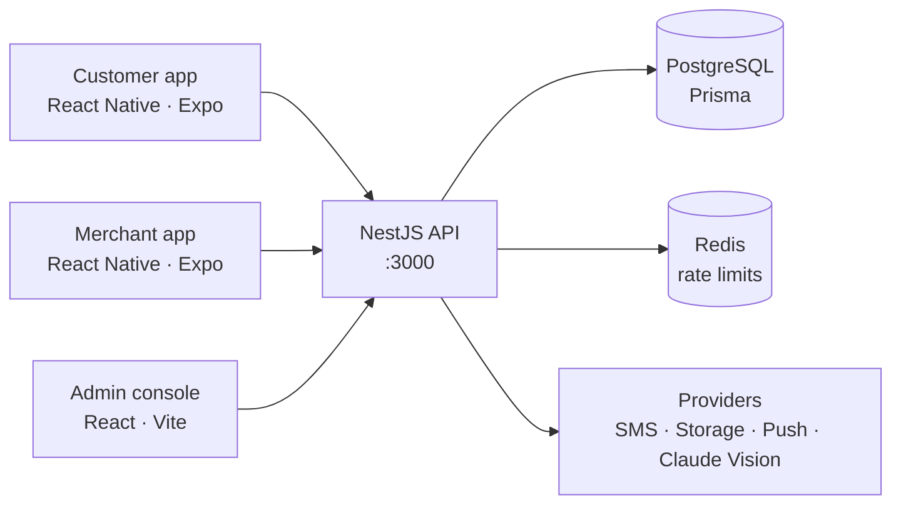

# Half-Dinar Shops

**A full-stack marketplace for Jordan's "half-dinar" variety stores. Customers browse a shop's real item-by-item inventory, order from their phone, and staff pick and confirm every item before delivery.**

The project includes a customer mobile app, a merchant app, an admin console, and a production-minded API. It is built for a single-shop pilot with cash on delivery.


---

## The apps

| App | Folder | For | Highlights |
|---|---|---|---|
| **Customer app** | `mobile/` | Shoppers | Nearest-shop sorting, full shop inventory with prices, cart, orders, order tracking, push notifications |
| **Merchant app** | `merchant-app/` | Shop staff | Product management, order picking and confirmation, **AI product entry from a photo** |
| **Admin console** | `merchant-dashboard/` | Platform admins | Approve, reject, and suspend merchant accounts |
| **API** | `backend/` | All clients | NestJS REST API with PostgreSQL, Redis, and pluggable providers |

All apps support **Arabic and English** (i18next).

## Highlights

- **AI product entry:** a shop stocks thousands of items, so typing each one by hand is the biggest reason a catalogue never gets finished. The merchant photographs an item, and Claude's vision model fills in the name, category, and price for review.
- **Phone + OTP authentication** with JWTs stored in the device keystore (Keychain / Keystore), not plain storage.
- **Redis-backed rate limiting** that survives restarts and scales across instances.
- **Real-time order stream** for merchants (a Server-Sent Events endpoint scoped to the merchant's own shop), and Expo push notifications for customers.
- **Provider seams for going live:** SMS (Twilio), image storage (Cloudflare R2 / S3), push, and AI vision each sit behind an interface. Switching from development to production is a config change, not a code change, and the API refuses to start in production if a required provider is missing.
- **Tested:** Jest unit and integration tests against a real database, plus Playwright end-to-end suites for every client.

## Architecture



Backend modules: `auth`, `shops`, `products`, `categories`, `orders`, `merchants`, `admin`, `uploads`, `storage`, `sms`, `push`, `vision`, `rate-limit`.

## Getting started

**Requirements:** Node.js 20+, Docker

```bash
# 1. Start PostgreSQL (port 5433) and Redis (port 6380)
docker compose up -d

# 2. API (http://localhost:3000)
cd backend
cp .env.example .env
npm install
npm run db:migrate
npm run seed               # sample shop, categories, and products
npm run start:dev
```

```bash
# Admin console (http://localhost:5173)
cd merchant-dashboard
npm install
npm run dev
```

```bash
# Customer app or merchant app (Expo)
cd mobile                  # or: cd merchant-app
npm install
npm start                  # scan the QR code with Expo Go
```

Point the mobile apps at your API with `EXPO_PUBLIC_API_BASE`. In development, OTP codes, image storage, and AI vision run in demo mode, so no external accounts are needed.

## Tests

```bash
cd backend && npm test               # unit tests
cd backend && npm run test:db        # integration tests against PostgreSQL
cd mobile && npm run test:e2e        # Playwright end-to-end (also in merchant-app/ and merchant-dashboard/)
```

## Going to production

Step-by-step setup for each external service is in [`docs/`](docs): [SMS](docs/SMS_SETUP.md), [image storage](docs/STORAGE_SETUP.md), [Redis](docs/REDIS_SETUP.md), [push notifications](docs/PUSH_SETUP.md), and [AI vision](docs/AI_VISION_SETUP.md).

## Author

**Mohammad Albreim**, Data Science & AI
[LinkedIn](https://linkedin.com/in/albreim-ai-ds) · [GitHub](https://github.com/Mo7ammadosama)
